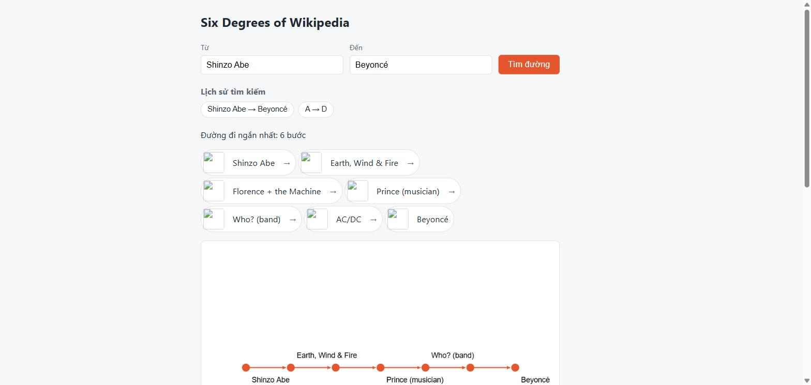
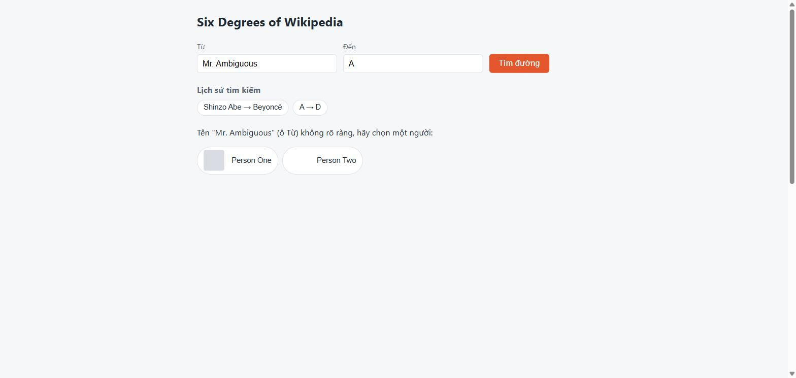

# Six Degrees of Wikipedia (Python)

Find the shortest chain of Wikipedia links between two people — in English or Japanese — with an
animated graph and shareable permalinks. Stateless, no database, and zero calls to Wikipedia at
request time: the whole dataset is precomputed offline and baked into a single Docker image.

**Status:** all 4 planned implementation phases shipped · **9,997 people · 427,057 edges · 119,335
aliases** · **383 automated tests** (280 backend `pytest` + 103 frontend `Vitest`), all traced to a
written spec · latest release `v1.0.2`.

## Screenshot / demo



Bilingual name resolution returning multiple candidates for an ambiguous match, plus client-side
search history:



No hosted demo is running for this repo yet — it's built to run in one command locally (see
[Docker / local setup](#docker--local-setup) below), or via `docker build && docker run` for a
production-like environment. What you'd see: a two-field search form, a chip-style search history,
the found path as a row of person cards, and an animated graph (Sigma.js/WebGL) that reveals the
BFS search level by level, with the answer path highlighted and unrelated explored nodes fading by
distance from the start.

## Key features

- **Bilingual name resolution** — canonical English titles, English redirects, Japanese titles, and
  Japanese redirects all resolve to the same person (`GET /api/resolve`); ambiguous input returns
  every candidate instead of guessing.
- **Shortest-path search** — `GET /api/search` runs BFS over the precomputed graph and returns the
  full path plus level-by-level exploration data in one response.
- **Animated, WebGL graph view** — Sigma.js + Graphology draw exactly what the API already returned;
  no extra endpoint exists just for the visualization.
- **Shareable, crawler-friendly links** — `/share?p=A&p=B&...` re-validates the path server-side and
  injects Open Graph preview tags, so chat apps that don't run JavaScript still render a preview.
- **Client-side search history** — `localStorage`, capped at 20 entries, no account needed.

## Architecture

```
Browser (React SPA, Sigma.js)
   │  HTTP: SPA · /api/* · /share
   ▼
FastAPI backend  ──serves──► dist/ (built SPA, static + SPA fallback)
   │
   ├── GET /api/search, /api/resolve, /api/path  (SPA calls only /api/search and /api/path)
   ├── GET /api/people, /share
   │
   ├── Resolver  (EN/JA input → canonical name, pure, in-RAM)
   ├── BFS / Graph  (shortest path, pure, in-RAM)
   │
   ▼
Dataset JSON, read-only, loaded into RAM
   graph.json · people.json · aliases.json
   ▲  COPY at Docker build time (never at runtime)
data/*.json (repo)
   ▲  writes only these files, offline
Fetcher (run by hand)  ──sequential, rate-limited──►  MediaWiki Action API
```

The browser also loads person thumbnails directly from the Wikimedia Image CDN — the only outbound
network call the *running* application ever makes. A component-level diagram built with `archify`
is available on request (not checked into this repo).

Three constraints shaped this (full reasoning in `SPEC.md` §1, ADR-001..014): **stateless, no
database** (history is client-side, share links are re-validated server-side); **everything
precomputed offline**, so the runtime never touches MediaWiki; and **one container** — a
multi-stage Dockerfile builds the frontend, then a single `python:3.12-slim` process serves the
API, `/share`, and the SPA.

## Tech stack

| | |
|---|---|
| Backend | Python 3.12, FastAPI 0.141, Pydantic 2.13 — no database |
| Frontend | React 19, TypeScript, Vite, Sigma.js 3 + Graphology |
| Data | `httpx`-based offline fetcher against the MediaWiki Action API |
| Testing | `pytest` (backend), `Vitest` + Testing Library (frontend) |
| Deploy | One `python:3.12-slim` Docker image, multi-stage build |

## Technical highlights

- **Removed a WebSocket based on measurement, not assumption.** The original design streamed BFS
  progress over a WebSocket to avoid a slow request; measuring showed BFS over ~10k nodes finishes
  in single-digit milliseconds. Replaced with one `GET` plus a client-side animation timer.
- **Bilingual resolution with zero live dependency on Wikipedia.** All alias discovery (English
  redirects, Japanese titles/redirects) happens offline in the fetcher; the runtime resolver is a
  pure in-RAM lookup, and ambiguous matches always return every candidate — never a silent guess.
- **Dataset writes can't half-corrupt a running system.** The fetcher validates and stages all three
  output files together and only swaps them into `data/` if every check passes.
- **Two real bugs only a real browser could catch.** A Windows-only `asyncio` network-guard
  incompatibility, and GraphView label overlap/clipping that Sigma-mocking unit tests structurally
  can't see — both found via manual Chrome + WebGL testing, then locked in with regression tests.

## Dataset / results

**9,997 people · 427,057 directed edges · 119,335 aliases** (98,578 English redirects, 12,347
Japanese redirects, 8,410 Japanese titles; 0 ambiguous match keys), generated from a 10,000-name
seed list by the fetcher in this repo. All four implementation phases shipped against a spec
revised 15 times as real constraints (rate-limit policy, Unicode edge cases, a library
deprecation, a browser-only rendering bug) surfaced during implementation.

## Testing

| | Tool | Count |
|---|---|---|
| Backend | `pytest` | 280 |
| Frontend | `Vitest` + Testing Library | 103 |
| **Total** | | **383** |

Every test carries an ID (`@pytest.mark.spec("BFS-04")` / `@spec FE-03`) that must match a row in
`SPEC.md` §7; a custom test-collection check fails the run if a required ID has no test, or a test
references an ID that doesn't exist. Backend tests run against a small self-authored fixture graph
(never the real dataset) with all network access blocked at the socket level; frontend tests fail if
`fetch` is left unmocked, and never render real WebGL.

## Docker / local setup

```bash
docker build -t sixth-degree .
docker run --rm -p 8000:8000 sixth-degree
# open http://localhost:8000
```

The image bundles the official dataset and the built frontend; it never calls the network at
runtime.

For local development instead (from the repo root):

```bash
# backend
cd backend
pip install -e ".[test]"
DATA_DIR=../data DIST_DIR=../frontend/dist uvicorn app.main:create_app --factory --reload
```

On Windows, `VAR=value command` is bash/POSIX-only and won't work in `cmd.exe` or PowerShell; set
the two environment variables first instead:

```powershell
# PowerShell, from backend/
$env:DATA_DIR = "../data"; $env:DIST_DIR = "../frontend/dist"
uvicorn app.main:create_app --factory --reload
```

```bash
# frontend, in another shell, from the repo root
cd frontend
npm install
npm run dev
```

## Documentation

- [`SPEC.md`](./SPEC.md) — the full implementation contract (Vietnamese): schemas, invariants, ADRs,
  every test ID. This repository's source of truth.
- [`docs/personal-development-ja.md`](./docs/personal-development-ja.md) — 1-page 個人開発実績サマリー
  (Japanese).
- [`docs/portfolio-ja.md`](./docs/portfolio-ja.md) — detailed technical portfolio (Japanese).
- [`docs/portfolio-en.md`](./docs/portfolio-en.md) — detailed technical portfolio (English).
