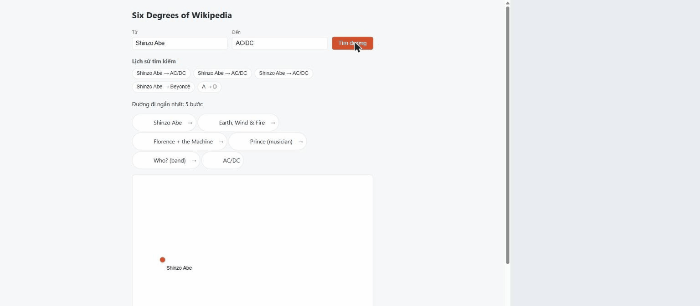

Live Demo
https://six-degrees-wikipedia-psi.vercel.app/

# Six Degrees of Wikipedia (Python)

Find the shortest chain of Wikipedia links between two people — in English or Japanese — with an
animated graph and shareable permalinks. Stateless, no database, and zero calls to Wikipedia at
request time: the whole dataset is precomputed offline and baked into a single Docker image.

**Status:** all 4 planned implementation phases shipped · **9,997 people · 427,057 edges · 119,335
aliases** · **415 automated tests** (281 backend `pytest` + 134 frontend `Vitest`), all traced to a
written spec (`SPEC.md`, currently v2.18) · latest tagged release `v1.0.3`; English UI, a 3D graph
view, and Vercel deployment support have shipped since that tag.

## Screenshot / demo




The real BFS search animating level by level, then a quick pan/zoom on the resulting graph — no
mocked data, captured against the running app.

Bilingual name resolution returning multiple candidates for an ambiguous match, plus client-side
search history:


A hosted demo is running at **[six-degrees-wikipedia-psi.vercel.app](https://six-degrees-wikipedia-psi.vercel.app/)**
(see the link at the top of this file). It's also built to run in one command locally (see
[Docker / local setup](#docker--local-setup) below), or via `docker build && docker run` for a
production-like environment. What you'd see: a Start/End combobox with client-side autocomplete, a
Search Log panel that replays the search as it happens, the found path as a row of clickable
person→Wikipedia links, and a rotatable 3D graph (`3d-force-graph`/Three.js, WebGL) that reveals the
BFS search level by level, with the answer path highlighted and unrelated explored nodes fading by
distance from the start. The screenshots below predate this UI/graph redesign and no longer match
current `HEAD` — kept for now as a record of the earlier look.

## Key features

- **Bilingual name resolution** — canonical English titles, English redirects, Japanese titles, and
  Japanese redirects all resolve to the same person (`GET /api/resolve`); ambiguous input returns
  every candidate instead of guessing.
- **Client-side autocomplete** — the Start/End fields suggest names from `GET /api/people` (fetched
  once, filtered entirely in the browser); no new backend route was added for this.
- **Shortest-path search** — `GET /api/search` runs BFS over the precomputed graph and returns the
  full path plus level-by-level exploration data in one response.
- **Rotatable 3D graph view** — `3d-force-graph` (Three.js/WebGL) draws exactly what the API already
  returned; no extra endpoint exists just for the visualization. Drag to rotate, scroll/pinch to
  zoom, arrow keys or WASD to pan, and a "Reset view" button flies the camera back to its starting
  framing.
- **Search Log panel** — a client-side, per-level replay of the same `SearchResponse` the graph
  already has; "Connected"/"Disconnected" here means "a search is in flight or done", not an actual
  live connection to anything.
- **Shareable, crawler-friendly links** — `/share?p=A&p=B&...` re-validates the path server-side and
  injects Open Graph preview tags, so chat apps that don't run JavaScript still render a preview;
  each name in a valid path also links directly to that person's Wikipedia page.
- **Client-side search history** — `localStorage`, capped at 20 entries, no account needed.

## Architecture

```
Browser (React SPA, 3d-force-graph/Three.js)
   │  HTTP: SPA · /api/* · /share
   ▼
FastAPI backend  ──serves──► dist/ (built SPA, static + SPA fallback)
   │
   ├── GET /api/search, /api/path  (the search + share flow the SPA actually calls)
   ├── GET /api/people             (PersonCombobox autocomplete only, one call, cached client-side)
   ├── GET /api/resolve, /share
   │
   ├── Resolver  (EN/JA input → canonical name, pure, in-RAM)
   ├── BFS / Graph  (shortest path, pure, in-RAM)
   │
   ▼
Dataset JSON, read-only, loaded into RAM
   graph.json · people.json · aliases.json
   ▲  COPY at Docker build time (never at runtime)
data/*.json (repo)
   ▲  writes only these files, offline
Fetcher (run by hand)  ──sequential, rate-limited──►  MediaWiki Action API

Deployment: one Dockerfile (multi-stage, digest-pinned base images). `Dockerfile.vercel` is a git
symlink to it, so Vercel's Fluid Compute picks up the exact same build (listens on $PORT).
```

The browser also loads person thumbnails directly from the Wikimedia Image CDN — the only outbound
network call the *running* application ever makes. A component-level, evidence-checked diagram
built with `archify` is at
[`docs/architecture/six-degrees-v1.0.x-final-architecture.html`](./docs/architecture/six-degrees-v1.0.x-final-architecture.html)
(tracked in this repo; also embedded in
[`docs/interview-profile-ja.html`](./docs/interview-profile-ja.html)).

Three constraints shaped this (full reasoning in `SPEC.md` §1, ADR-001..014): **stateless, no
database** (history is client-side, share links are re-validated server-side); **everything
precomputed offline**, so the runtime never touches MediaWiki; and **one container** — a
multi-stage Dockerfile builds the frontend, then a single `python:3.12-slim` process serves the
API, `/share`, and the SPA.

## Tech stack

| | |
|---|---|
| Backend | Python 3.12, FastAPI 0.141, Pydantic 2.13 — no database |
| Frontend | React 19, TypeScript, Vite, `3d-force-graph` (Three.js) |
| Data | `httpx`-based offline fetcher against the MediaWiki Action API |
| Testing | `pytest` (backend), `Vitest` + Testing Library (frontend) |
| Deploy | One `python:3.12-slim` Docker image, multi-stage build; also deployed on Vercel (Fluid Compute) via `Dockerfile.vercel` |

## Technical highlights

- **Removed a WebSocket based on measurement, not assumption.** The original design streamed BFS
  progress over a WebSocket to avoid a slow request; measuring showed BFS over ~10k nodes finishes
  in single-digit milliseconds. Replaced with one `GET` plus a client-side animation timer.
- **Bilingual resolution with zero live dependency on Wikipedia.** All alias discovery (English
  redirects, Japanese titles/redirects) happens offline in the fetcher; the runtime resolver is a
  pure in-RAM lookup, and ambiguous matches always return every candidate — never a silent guess.
- **Dataset writes can't half-corrupt a running system.** The fetcher validates and stages all three
  output files together and only swaps them into `data/` if every check passes.
- **Real bugs only a real browser could catch.** A Windows-only `asyncio` network-guard
  incompatibility on the backend; on the frontend, a black-screen crash from `3d-force-graph`
  defaulting to `"trackball"` controls (no `.listenToKeyEvents`) instead of the `"orbit"` type the
  WASD-pan feature needs — invisible to WebGL-mocking unit tests, found via manual Chrome testing,
  then locked in with a regression test and a one-line `controlType: "orbit"` fix.

## Dataset / results

**9,997 people · 427,057 directed edges · 119,335 aliases** (98,578 English redirects, 12,347
Japanese redirects, 8,410 Japanese titles; 0 ambiguous match keys), generated from a 10,000-name
seed list by the fetcher in this repo. All four implementation phases shipped against a spec that
has since gone through 18 revisions (currently `SPEC.md` v2.18) as real constraints (rate-limit
policy, Unicode edge cases, a library deprecation, browser-only rendering bugs, and — post-v1.0.3 —
an English-UI switch and a Sigma.js→3d-force-graph graph-library swap) surfaced during and after
initial implementation.

## Testing

| | Tool | Count |
|---|---|---|
| Backend | `pytest` | 281 |
| Frontend | `Vitest` + Testing Library | 134 |
| **Total** | | **415** |

Every test carries an ID (`@pytest.mark.spec("BFS-04")` / `@spec FE-03`) that must match a row in
`SPEC.md` §7; a custom test-collection check fails the run if a required ID has no test, or a test
references an ID that doesn't exist. Backend tests run against a small self-authored fixture graph
(never the real dataset) with all network access blocked at the socket level; frontend tests fail if
`fetch` is left unmocked, and never render real WebGL.

## Docker / local setup

```bash
docker build -t sixth-degree .
docker run --rm -p 8000:8000 sixth-degree
# open http://localhost:8000
```

The image bundles the official dataset and the built frontend; it never calls the network at
runtime.

**Deploying to Vercel:** `Dockerfile.vercel` is a git symlink to `Dockerfile` (not a separate
build) — Vercel detects it, builds the same image, and runs it on Fluid Compute listening on
`$PORT`. The live demo linked at the top of this file runs this way.

**Behind a reverse proxy:** `og:url` (SPEC Q-6) is built from the current request's base URL,
scheme included. uvicorn already reads `FORWARDED_ALLOW_IPS` from the environment; unset, it
trusts only `127.0.0.1`/`::1`, so a TLS-terminating reverse proxy elsewhere on the network would
make `og:url` wrongly come out as `http://`. Set it to the proxy's IP or CIDR to fix that, e.g.
`-e FORWARDED_ALLOW_IPS=10.0.0.0/8`. This is opt-in — the default behavior is unchanged.

For local development instead (from the repo root):

```bash
# backend
cd backend
pip install -e ".[test]"
DATA_DIR=../data DIST_DIR=../frontend/dist uvicorn app.main:create_app --factory --reload
```

On Windows, `VAR=value command` is bash/POSIX-only and won't work in `cmd.exe` or PowerShell; set
the two environment variables first instead:

```powershell
# PowerShell, from backend/
$env:DATA_DIR = "../data"; $env:DIST_DIR = "../frontend/dist"
uvicorn app.main:create_app --factory --reload
```

```bash
# frontend, in another shell, from the repo root
cd frontend
npm install
npm run dev
```

## Documentation

- [`SPEC.md`](./SPEC.md) — the full implementation contract (Vietnamese): schemas, invariants, ADRs,
  every test ID. This repository's source of truth.
- [`docs/personal-development-ja.md`](./docs/personal-development-ja.md) — 1-page 個人開発実績サマリー
  (Japanese).
- [`docs/portfolio-ja.md`](./docs/portfolio-ja.md) — detailed technical portfolio (Japanese).
- [`docs/portfolio-en.md`](./docs/portfolio-en.md) — detailed technical portfolio (English).
- [`docs/interview-profile-ja.html`](./docs/interview-profile-ja.html) — interview presentation page
  (Japanese; open in a browser), including an embedded architecture diagram.
